# 📘 Documentation Technique – MAYZ Mobile

## 0. 🧭 Vue d'Ensemble du Projet

```mermaid
graph TD
  A[main.tsx] --> B[LocationProvider]
  B --> C[UserProvider]
  C --> D[PinProvider]
  D --> E[QRCodeProvider]
  E --> F[App.tsx]
  F --> G1[MapView]
  F --> G2[AuthScreens]
  F --> G3[QRScanner]
  G1 --> H1[MapDisplay]
  G1 --> H2[SearchControl]
  G1 --> H3[NavigationInterface]
  G1 --> H4[PinManagement]
  G1 --> H5[SettingsSidebar]
  H1 --> I1[useRoute]
  H1 --> I2[useAlertPins]
  I1 --> J1[useRouteCalculation]
  I1 --> J2[useRouteNavigation]
  I1 --> J3[useRouteRerouting]
  J2 --> K1[locationTracker]
  J2 --> K2[ttsManager]
```



### 🎯 Objectif du projet

MAYZ Mobile est une application de navigation en temps réel développée comme projet mobile. Inspirée de Waze, elle permet aux utilisateurs de :

- Naviguer en temps réel avec des itinéraires optimisés
- Signaler des incidents routiers (accidents, embouteillages, routes fermées, contrôles policiers)
- Contribuer à la communauté via la validation de signalements
- Recevoir des alertes en fonction de leur trajet
- Générer et transférer des itinéraires via QR Code

L'application repose sur une architecture de composants modulaires, avec une forte séparation des préoccupations entre la visualisation, la logique métier et l'accès aux données.

### 🧩 Fonctionnalités clés

- Authentification par email + Google OAuth
- Calcul d'itinéraires optimisés (avec options d'évitement)
- Signalement et visualisation d'incidents
- Navigation GPS avec instructions vocales
- Scan de QR Code pour importation d'itinéraire

### 🧱 Stack technique

- React Native + Expo
- TypeScript
- Expo Router (navigation)
- Context API (gestion d'état)
- Mapbox SDK pour React Native (@rnmapbox/maps)
- Axios (API REST)
- React Native TTS (instructions vocales)
- Expo Location (géolocalisation)

## 1. 🛠️ Initialisation et Configuration du Projet

### 1.1. Structure des Répertoires

L'application suit une architecture modulaire :

- **app/** : Écrans principaux via Expo Router
- **components/** : Composants UI réutilisables
- **hooks/** : Logique métier encapsulée et réutilisable
- **providers/** : Gestion d'état global via Context API
- **services/** : Communication avec les APIs
- **utils/** : Fonctions utilitaires
- **constants/** : Valeurs constantes (couleurs, thèmes)
- **types/** : Types et interfaces TypeScript

Cette organisation garantit une séparation claire des responsabilités, rendant le code plus maintenable et évolutif.

### 1.2. Variables d'Environnement et Sécurité des Clés

Le projet utilise une stratégie à deux fichiers d'environnement pour sécuriser les clés API :

- **.env** : Contient toutes les variables, y compris les clés sensibles (non publié dans le build final)
- **.env.rnconfig** : Contient uniquement les clés publiques (incluses dans le build)

Cette approche permet d'utiliser les clés secrètes pour la configuration du build sans les inclure dans l'APK final, réduisant les risques de fuite de clés. Les variables sont intégrées à la compilation via `react-native-config`.

### 1.3. Configuration Expo

Le fichier `app.config.js` centralise la configuration :

- Meta-informations (nom, version, icônes)
- Permissions Android/iOS (location, caméra)
- Plugins natifs (Mapbox, Google Sign-In, Scanner)
- Configuration spécifique aux plateformes

Les plugins sont configurés pour intégrer nativement les SDKs tiers nécessaires, notamment la configuration de Mapbox qui utilise la variable d'environnement `MAPBOX_SK` pour le token de téléchargement.

## 2. 🏗️ Layout Principal et Contexte Global

### 2.1. Chargement et Splash Screen

L'application utilise `expo-splash-screen` pour fournir une expérience utilisateur fluide au démarrage. Le splash screen reste affiché jusqu'à ce que les ressources critiques (polices, initialisation des providers) soient chargées.

### 2.2. Initialisation des Providers Globaux

Le fichier `app/_layout.tsx` initialise l'arbre des providers selon une hiérarchie précise :

1. `PaperProvider` : Thème visuel
2. `UserProvider` : Authentification et préférences
3. `QRCodeProvider` : Gestion des codes QR scannés
4. `LocationProvider` : Gestion de la localisation et permissions
5. `PinProvider` : Gestion des signalements
6. `GestureHandlerRootView` et `BottomSheetModalProvider` : Support des gestes

Cette structure en "oignon" permet à chaque provider d'accéder aux fonctionnalités des providers qui l'englobent, établissant une cascade de contextes accessibles à tous les composants.

### 2.3. Structure de Navigation Principale

Expo Router est utilisé pour définir la structure des écrans principaux :

- `/` : Écran principal (carte)
- `/auth/*` : Écrans d'authentification
- `/qr-scanner` : Écran de scan de QR code
- `+not-found` : Écran 404 pour les routes inexistantes

Cette architecture permet une navigation déclarative et le routing typé, simplifiant la navigation entre les différentes sections de l'application.

## 3. 🔐 Module d'Authentification et Gestion des Utilisateurs

### 3.1. UserProvider

`UserProvider` est le cœur de la gestion d'authentification et des données utilisateur :

- Gestion du token JWT (`bearerToken`)
- État de connexion (`isSignedIn`)
- Données utilisateur (`userData`) incluant les préférences
- Méthodes d'authentification, déconnexion et mise à jour du profil

À l'initialisation, le provider vérifie si l'utilisateur est déjà connecté via Google, récupère ses informations, et configure le token d'authentification pour toutes les futures requêtes API.

### 3.2. Flux d'Authentification

Deux méthodes d'authentification sont supportées :

**Email/Password :**
- Validation des champs par `react-hook-form`
- Appel à l'API backend via `loginWithEmail()`
- En cas de succès, enregistrement du token et récupération des données utilisateur

**Google Sign-In :**
- Utilisation de `GoogleSignin.signIn()` pour obtenir un token ID
- Validation du token auprès du backend via `googleAndroid()` ou `googleIOS()`
- Même traitement post-authentification que pour email/password

### 3.3. Gestion des Préférences Utilisateur

Les préférences de routage (évitement de péages, autoroutes, etc.) sont :

1. Stockées dans `userData.preferences`
2. Présentées dans l'interface via `RoutingPreferences`
3. Modifiables via `updatePreferences()` du `UserProvider`
4. Synchronisées avec le backend
5. Utilisées par le hook `useRoute` pour paramétrer les calculs d'itinéraires

Le système maintient la cohérence entre les préférences utilisateur stockées sur le serveur et les paramètres de routage utilisés localement.

## 4. 🗺️ Module de Cartographie et Géolocalisation

### 4.1. Configuration et Initialisation Mapbox

Mapbox est configuré avec le token public via `Mapbox.setAccessToken()`. Le composant `MapDisplay` est le point central de visualisation, utilisant la bibliothèque `@rnmapbox/maps`.

### 4.2. MapDisplay et Composants Visuels

`MapDisplay` orchestre l'affichage des éléments cartographiques :

- Fond de carte Mapbox (`MapView`)
- Contrôle de caméra dynamique selon le mode (`Camera`)
- Indicateur de position utilisateur (`LocationPuck`)
- Affichage des itinéraires (principal, alternatifs, parcouru) via `ShapeSource` et `LineLayer`
- Marqueur de destination (`PointAnnotation`)
- Couche de signalements (`MapboxAlertPinsLayer`)

L'affichage s'adapte dynamiquement en fonction du mode de l'application (carte simple, sélection d'itinéraire, navigation) défini dans `app/index.tsx`.

### 4.3. Gestion de la Localisation

La localisation est gérée par deux composants majeurs :

**locationTracker :**
- Encapsule `expo-location` dans une classe avec API événementielle
- Fournit le suivi en temps réel et les changements de cap
- Gère la demande de permissions et leur état

**LocationProvider :**
- Vérifie et demande les permissions nécessaires
- Fournit un token de session pour Mapbox Search
- Affiche un écran dédié si les permissions sont refusées

## 5. 🔍 Module de Recherche et Sélection d'Itinéraire

### 5.1. Interface de Recherche et Sélection

`SearchAndRouteControl` offre une interface utilisateur pour :

1. Rechercher une destination via l'API Mapbox Search
2. Afficher les suggestions d'adresses
3. Présenter les options d'itinéraires calculées
4. Permettre la sélection entre différents itinéraires
5. Démarrer la navigation

L'interface s'adapte dynamiquement entre le mode recherche et le mode sélection d'itinéraire, avec des transitions animées fluides.

### 5.2. Calcul d'Itinéraires

Le calcul d'itinéraires est géré par une chaîne de hooks spécialisés :

**useRouteCalculation :**
- Utilise `fetchRoute` pour appeler l'API Mapbox Directions
- Calcule l'itinéraire principal et les alternatives
- Analyse les caractéristiques des itinéraires (péages, autoroutes, etc.)
- Fournit `routeFeatures` pour afficher ces caractéristiques dans l'UI

**useRoute :**
- Coordonne le calcul initial, la sélection et le démarrage de la navigation
- Gère `routeExcludes` selon les préférences utilisateur ou données QR
- Expose l'état complet (itinéraires, chargement, erreurs) à `app/index.tsx`

Les itinéraires sont calculés en tenant compte des préférences d'évitement et recalculés automatiquement lorsque ces préférences changent.

## 6. 🚗 Module de Navigation Active

### 6.1. Logique de Navigation

La navigation active est pilotée par une série de hooks spécialisés :

**useRouteNavigation :**
- Suit la position utilisateur via `locationTracker`
- Détermine l'étape actuelle dans l'itinéraire
- Calcule la distance à la prochaine manœuvre
- Détecte les déviations hors route
- Vérifie si l'utilisateur est arrivé à destination
- Gère les instructions vocales via `ttsManager`

**useRouteRerouting :**
- Détermine quand recalculer l'itinéraire (distance/temps écoulé)
- Gère la logique de recalcul pour éviter les opérations trop fréquentes
- Communique avec l'API Mapbox pour obtenir un nouvel itinéraire

**ttsManager :**
- Encapsule `react-native-tts` pour la synthèse vocale
- Gère les instructions vocales avec priorité
- Évite la répétition des mêmes instructions

### 6.2. Interface de Navigation

L'interface utilisateur de navigation est fournie par `NavigationInterface` qui affiche :

- Instructions textuelles pour la prochaine manœuvre
- Distance à la prochaine manœuvre
- Distance et durée restantes
- Heure d'arrivée estimée
- Indicateurs de trafic
- Boutons de contrôle (recalculer, arrêter)

Le mode navigation transforme également l'affichage de la carte (inclinaison, zoom, suivi avec cap).

## 7. 📍 Module de Gestion des Signalements

### 7.1. Modèle de Données et État

Les signalements ("pins") sont gérés par le `PinProvider` qui :

- Stocke la liste des pins autour de l'utilisateur
- Fournit des méthodes pour créer/supprimer des pins
- Gère la sélection d'un pin pour affichage détaillé

Les différents types de pins (obstacle, embouteillage, accident, police, travaux) sont définis dans `types/api.ts` et disposent chacun d'une icône et d'une couleur spécifiques.

### 7.2. Récupération et Affichage des Pins

**useAlertPins :**
- Récupère les pins autour de la position utilisateur
- Rafraîchit les données lors de déplacements significatifs
- Gère le polling périodique pour les mises à jour

**MapboxAlertPinsLayer :**
- Affiche les pins sur la carte avec leurs icônes respectives
- Gère le clustering pour éviter la surcharge visuelle
- Détecte les interactions (tap sur pin individuel ou cluster)

### 7.3. Création de Signalements

Le processus de création de signalement est géré par :

- `IncidentReportButton` : Bouton d'accès flottant sur la carte
- `ReportAlertModal` : Interface de sélection du type et description
- `LoginRequiredModal` : Redirection vers connexion si non authentifié

Lorsqu'un signalement est créé, il est immédiatement envoyé au backend et ajouté à la liste locale des pins.

### 7.4. Vérification de Proximité

Une fonctionnalité clé est la vérification de proximité :

1. `useNearbyPinProximity` détecte quand l'utilisateur passe près d'un signalement existant
2. `PinConfirmationModal` demande si le signalement est toujours d'actualité
3. Si l'utilisateur répond "non", le signalement est supprimé du système

Ce mécanisme contribue à maintenir la base de données de signalements à jour grâce à la participation communautaire.

## 8. 📷 Module de Scan QR Code

### 8.1. Écran de Scan

L'écran `qr-scanner.tsx` utilise `expo-barcode-scanner` pour capturer et traiter les QR codes contenant des données d'itinéraire.

### 8.2. Format et Traitement des Données

Les QR codes contiennent des URL de format spécifique :
```
https://mayz.com/route?to=5.377085;43.294235&exclude=motorway,toll,ferry
```

`routeUrlParser.tsx` extrait :
- Les coordonnées de destination (`to`)
- Les options d'évitement (`exclude`)

### 8.3. Intégration avec la Navigation

Une fois scanné, le QR code déclenche le processus suivant :

1. Le `QRCodeProvider` stocke temporairement les données
2. `app/index.tsx` détecte les nouvelles données et :
   - Configure la destination
   - Applique les exclusions spécifiées (remplaçant temporairement les préférences utilisateur)
   - Force le mode de sélection d'itinéraire
3. Le hook `useRoute` calcule les itinéraires selon ces paramètres
4. À la fin de la navigation ou en cas d'annulation, les préférences utilisateur sont restaurées

## 9. 📡 Communication avec l'API Backend

### 9.1. Configuration du Client HTTP

`services/useService.ts` configure Axios pour toutes les communications avec le backend :

```typescript
export const api = axios.create({
  baseURL: Config.API_URL,
  timeout: 10000,
  headers: {
    "Content-Type": "application/json",
  },
});
```

Un intercepteur gère les erreurs communes, notamment les problèmes d'authentification (401).

### 9.2. Endpoints Principaux

Le service expose des fonctions typées pour chaque endpoint :

**Authentification :**
- `googleAndroid/iOS/Web()` : Validation du token Google
- `loginWithEmail()` : Connexion classique
- `registerUser()` : Création de compte

**Gestion Utilisateur :**
- `getCurrentUser()` : Récupération du profil
- `updateUser()` : Mise à jour (y compris préférences)

**Gestion des Pins :**
- `fetchNearbyPins()` : Recherche par proximité
- `createPin()` : Création de signalement
- `deletePin()` : Suppression

**Statistiques :**
- `addItineraryStat()` : Enregistrement des trajets

Chaque fonction retourne une promesse avec un type de réponse bien défini, facilitant la gestion des erreurs et le typage des données.

## 10. 🧩 Logique Applicative et Composants UI

### 10.1. Gestion d'État UI dans app/index.tsx

L'écran principal utilise un `useReducer` avec `appReducer` pour gérer l'état complexe de l'interface :

```typescript
type AppState = {
  uiMode: "map" | "search" | "route-selection" | "navigation";
  destination: [number, number] | null;
  isSideMenuOpen: boolean;
  selectedPin: PinRead | null;
  isInitializing: boolean;
  isInitialRouteCalculated: boolean;
};
```

Cette approche permet des transitions d'état prévisibles et une logique de rendu conditionnelle claire.

### 10.2. Composants UI Réutilisables

L'application s'appuie sur une bibliothèque de composants réutilisables :

- `FloatingActionButton` : Actions principales flottantes
- `IconButton` : Boutons avec icônes
- `StyledTextInput` : Champs de saisie personnalisés

Ces composants garantissent une cohérence visuelle et facilitent l'évolution de l'interface.

### 10.3. Menu Latéral et Préférences

`SideMenu` offre un accès aux paramètres avec :

- Affichage du profil utilisateur ou option de connexion
- Préférences d'itinéraire personnalisables
- Animations fluides d'ouverture/fermeture

L'état du menu est synchronisé avec `app/index.tsx` pour une intégration harmonieuse avec les autres éléments d'interface.

## 11. 🛡️ Sécurité et Gestion des Clés API

### 11.1. Protection des Clés Sensibles

La stratégie de sécurité des clés API repose sur :

- Séparation `.env` (toutes les clés) / `.env.rnconfig` (clés publiques uniquement)
- Utilisation de `MAPBOX_PK` (Public Key) dans le code pour les appels API
- Utilisation de `MAPBOX_SK` (Secret Key) uniquement lors du build pour télécharger les ressources Mapbox
- Exclusion stricte des fichiers `.env` du contrôle de source via `.gitignore`

### 11.2. Authentification et Sécurité des Données

La sécurité des communications repose sur :

- Tokens JWT pour l'authentification avec le backend
- En-têtes `Authorization: Bearer ...` automatiquement ajoutés par Axios
- Suppression du token en cas d'expiration (réponse 401)
- Utilisation systématique de HTTPS pour toutes les communications
- Validation côté client des données sensibles via `react-hook-form`

### 11.3. Gestion des Permissions

Les permissions natives sont gérées de manière explicite :

- Localisation en premier plan pour le fonctionnement de base
- Localisation en arrière-plan pour la navigation continue
- Caméra pour le scan de QR code
- Demandes explicites avec explications à l'utilisateur
- Écrans de secours si les permissions sont refusées

## 12. 🚀 Génération de l'APK (Build Android)

### 12.1. Prérequis pour le Build

Pour générer l'APK, les éléments suivants sont nécessaires :

- JDK 17 ou supérieur
- Android SDK
- Variables d'environnement (ANDROID_HOME, JAVA_HOME)
- Chemin de projet court pour éviter les problèmes de longueur Windows

### 12.2. Processus de Génération

Le processus de build se déroule en plusieurs étapes :

1. **Install dependencies**

   ```bash
   npm install
   ```

2. **Generate native code for Android/iOS**

   ```bash
   npx expo prebuild --clean
   ```

3. **Link .env.rnconfig variable to native Android**

   ```bash
   npx react-native-integrate react-native-config
   ```

   and add this line near the top of `.\android\app\build.gradle`

   ```bash
   apply from: project(':react-native-config').projectDir.getPath() + "/dotenv.gradle"
   ```

4. **Exporter les Assets JavaScript :**
   ```bash
   npx expo export
   ```

5. **Naviguer vers le Répertoire Android :**
   ```bash
   cd android
   ```

6. **Nettoyer les Builds Précédents :**
   ```bash
   ./gradlew clean
   ```

7. **Assembler l'APK de Release :**
   ```bash
   ./gradlew assembleRelease
   ```

### 12.3. Localisation et Installation de l'APK

L'APK généré se trouve dans :
```
android/app/build/outputs/apk/release/app-release.apk
```

Ce fichier peut être :
- Installé directement sur un appareil Android
- Distribué manuellement
- Téléversé sur un service de distribution interne

### 12.4. Dépannage des Builds Android

Problèmes courants et solutions :

- **Erreurs de chemin trop long :** Déplacer le projet à un chemin plus court
- **Erreurs de variables d'environnement :** Vérifier `ANDROID_HOME` et `JAVA_HOME`
- **Erreurs Mapbox :** Vérifier `MAPBOX_SK` dans `.env` et les configurations dans `app.config.js`
- **Problèmes de dépendances :** Exécuter `npx react-native-integrate react-native-config` pour s'assurer que les variables d'environnement sont correctement intégrées

Pour résoudre la plupart des problèmes, la commande suivante est souvent efficace :
```bash
cd android && ./gradlew clean && cd .. && npm run android
```