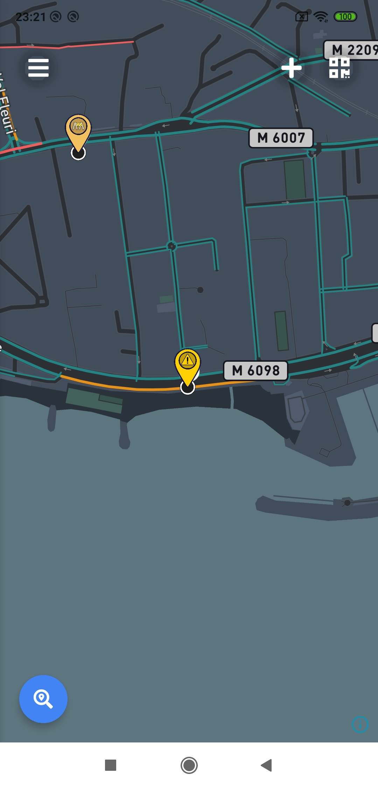
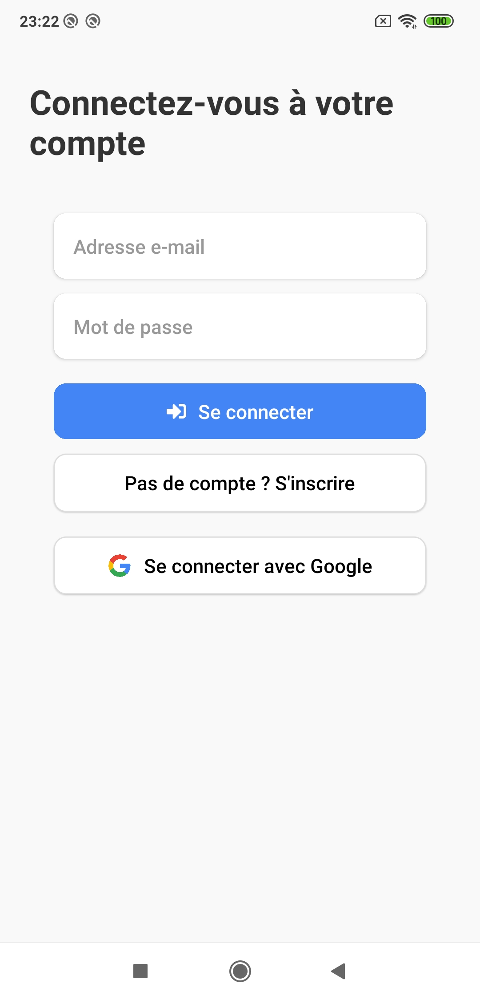
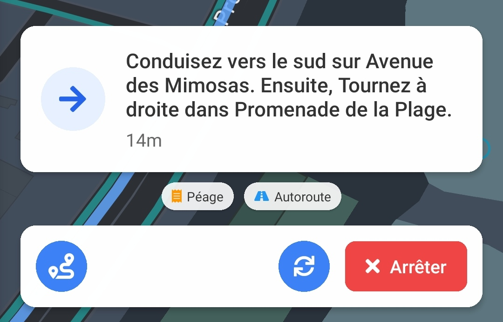
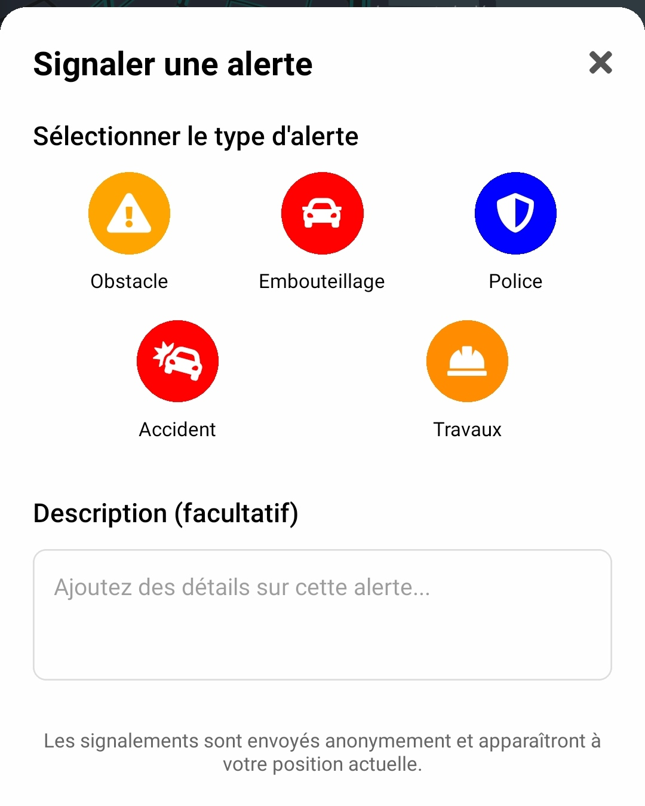
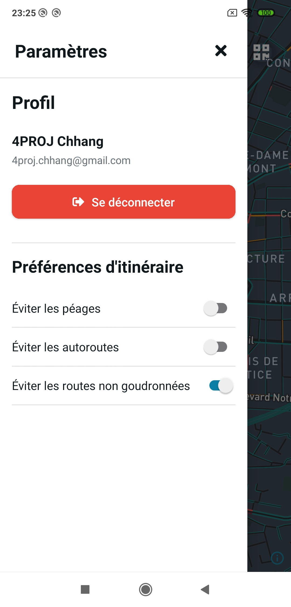
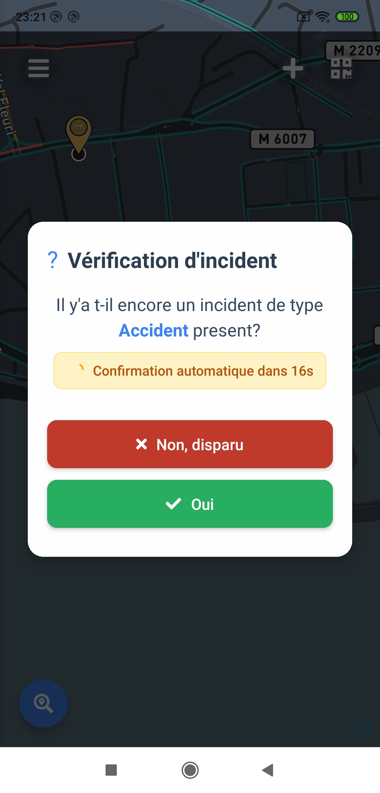

# 📘 Manuel utilisateur — Application mobile MAYZ

## Table des matières

- [Introduction](#🚀-introduction)
- [Installation](#📱-installation)
- [Premiers pas dans l'application](#🧭-premiers-pas-dans-lapplication)
- [Connexion](#🔐-connexion)
- [Naviguer sur la carte](#🗺️-naviguer-sur-la-carte)
- [Rechercher et suivre un itinéraire](#🚗-rechercher-et-suivre-un-itinéraire)
- [Signaler un incident](#📍-signaler-un-incident)
- [Personnaliser vos préférences](#⚙️-personnaliser-vos-préférences)
- [Scanner un QR code](#📷-scanner-un-qr-code)
- [Support](#support)

## 🚀 Introduction

**Bienvenue dans MAYZ Mobile, votre application communautaire de navigation pour signaler et éviter les incidents routiers en temps réel.**

MAYZ Mobile est conçue pour améliorer votre expérience de conduite quotidienne grâce à une communauté active qui partage des informations sur les conditions routières en temps réel. Que ce soit un accident, un embouteillage, un contrôle de police ou des travaux, tous les incidents signalés apparaissent instantanément sur votre carte.

L'application recalcule automatiquement votre itinéraire en tenant compte de ces informations pour vous proposer un trajet plus fluide et plus sûr, même si les conditions changent pendant votre déplacement.

Ce manuel s'adresse à tous les utilisateurs de l'application mobile MAYZ, disponible sur Android. Aucune connaissance technique préalable n'est nécessaire pour utiliser pleinement les fonctionnalités de l'application.

**MAYZ est disponible sur mobile et également sur [navigateur web](https://4proj.yoannchh.com/).**

## 📱 Installation

L'application MAYZ Mobile n'est pas disponible sur les stores (Google Play Store ou App Store) et n'est pas compatible avec iOS.

### Installation sur Android

1. Téléchargez le fichier APK de l'application depuis notre site web ou obtenez-le auprès de l'équipe de développement.
2. Sur votre appareil Android, ouvrez le fichier APK téléchargé.
3. Si nécessaire, autorisez l'installation d'applications provenant de sources inconnues dans les paramètres de sécurité de votre appareil.
4. Suivez les instructions à l'écran pour terminer l'installation.

### Utilisation en local (développement)

Vous pouvez également lancer l'application localement sur un appareil Android ou un émulateur en suivant les instructions du README du projet (nécessite Node.js, Android Studio, etc.).

### Permissions requises

Lors du premier lancement, l'application vous demandera d'accorder certaines permissions essentielles à son fonctionnement :

- **Localisation** : Nécessaire pour afficher votre position sur la carte et calculer vos itinéraires
- **Localisation en arrière-plan** : Permet de continuer la navigation même lorsque l'application n'est pas au premier plan
- **Caméra** : Requise uniquement pour scanner les QR codes d'itinéraires
- **Notifications** : Pour vous alerter des incidents sur votre trajet

Ces permissions peuvent être modifiées ultérieurement dans les paramètres de votre appareil.

## 🧭 Premiers pas dans l'application

Lorsque vous lancez MAYZ pour la première fois, l'application vous demande d'autoriser l'accès à votre localisation. Cette étape est cruciale pour que l'application puisse fonctionner correctement.

Une fois les permissions accordées, vous verrez la carte centrée sur votre position actuelle :

L'interface affiche :

1. **Bouton Menu** (en haut à gauche) : Ouvre le menu latéral des paramètres
2. **Bouton Signaler** (+ en haut) : Permet de signaler un incident
3. **Bouton QR Code** (en haut à droite) : Pour scanner un QR code d'itinéraire
4. **Bouton Recherche** (en bas à gauche) : Lance la recherche d'itinéraire

Votre position est indiquée par un point bleu sur la carte. Les incidents signalés apparaissent sous forme d'icônes correspondant à leur type.

## 🔐 Connexion

Bien que vous puissiez consulter la carte sans être connecté, certaines fonctionnalités comme le signalement d'incidents nécessitent un compte. Pour vous connecter :

1. Appuyez sur le **bouton Menu** (☰) en haut à gauche de l'écran
2. Sélectionnez **"Se connecter"** dans le menu qui apparaît
3. Vous pouvez vous connecter via :
   - Votre compte Google (en appuyant sur le bouton correspondant)
   - Votre email et mot de passe MAYZ

Si vous n'avez pas encore de compte, appuyez sur **"Pas de compte ? S'inscrire"** et remplissez le formulaire d'inscription.

Une fois connecté, votre profil apparaîtra en haut du menu latéral avec votre nom et votre photo (si disponible).

## 🗺️ Naviguer sur la carte

### Gestes de base

La carte interactive de MAYZ vous permet de :

- **Faire glisser** pour déplacer la carte
- **Pincer** pour zoomer/dézoomer
- **Appuyer** sur un incident pour voir ses détails
- **Appuyer** sur un regroupement d'incidents pour zoomer sur cette zone

La carte affiche automatiquement votre position et s'oriente dans le sens de votre déplacement en mode navigation.

### Visualiser les incidents

Les incidents sont représentés par différentes icônes selon leur type :

- 🚧 **Travaux routiers**
- 🚔 **Contrôle de police**
- 🚗 **Embouteillage**
- ⚠️ **Obstacle**
- 🚨 **Accident**

Appuyez sur un incident pour afficher plus d'informations :

- Type d'incident
- Heure du signalement
- Description (si disponible)
- Nom de l'utilisateur qui l'a signalé

## 🚗 Rechercher et suivre un itinéraire

### Rechercher une destination

1. Appuyez sur le **bouton Recherche** (🔍) en bas à gauche de l'écran
2. Entrez votre destination dans la barre de recherche qui apparaît
3. Sélectionnez l'adresse souhaitée parmi les suggestions

### Sélectionner un itinéraire

Une fois la destination saisie, l'application calcule plusieurs itinéraires possibles en prenant en compte vos préférences et les incidents signalés :

1. Les itinéraires s'affichent sur la carte comme diférentes options
2. Le panneau inférieur présente chaque itinéraire avec :

   - La durée estimée du trajet
   - La distance à parcourir
   - Les caractéristiques particulières (autoroutes, péages, etc.)

3. Appuyez sur l'itinéraire de votre choix pour le sélectionner
4. Appuyez sur **"Démarrer"** pour commencer la navigation

### Mode navigation

En mode navigation, l'interface change pour vous présenter :

1. Les instructions de virage à virage avec indication vocale
2. La distance jusqu'à la prochaine manœuvre
3. Une estimation du temps d'arrivée

Si vous déviez de l'itinéraire prévu, l'application recalculera automatiquement un nouvel itinéraire.

Pour arrêter la navigation, appuyez sur le bouton **"Arrêter"** en bas de l'écran.

## 📍 Signaler un incident

Pour contribuer à la communauté MAYZ en signalant un incident :

1. Appuyez sur le **bouton +** en haut de l'écran
2. Choisissez le type d'incident à signaler parmi les options proposées :

   - Obstacle
   - Embouteillage
   - Police
   - Accident
   - Travaux

3. Ajoutez une description (facultatif)
4. Appuyez sur l'icône correspondante pour valider

L'incident sera immédiatement visible sur la carte et partagé avec tous les utilisateurs de MAYZ à proximité.

**Note** : Vous devez être connecté pour pouvoir signaler un incident. Si vous tentez de signaler un incident sans être connecté, l'application vous invitera à vous identifier.

## ⚙️ Personnaliser vos préférences

Pour accéder aux paramètres de l'application :

1. Appuyez sur le **bouton Menu** (☰) en haut à gauche de l'écran
2. Un menu latéral s'affiche avec votre profil (si connecté) et plusieurs options

### Préférences d'itinéraire

Dans le menu, vous pouvez personnaliser vos préférences de navigation en activant ou désactivant les options suivantes :

- **Éviter les péages**
- **Éviter les autoroutes**
- **Éviter les routes non goudronnées**

Ces préférences seront automatiquement prises en compte lors du calcul de vos itinéraires.

## 📷 Scanner un QR code

MAYZ vous permet de recevoir un itinéraire depuis la version web de l'application grâce à un QR code :

1. Sur la version web de MAYZ, planifiez votre itinéraire et cliquez sur "Envoyer sur mon téléphone"
2. Sur l'application mobile, appuyez sur le **bouton QR Code** en haut à droite de l'écran
3. Pointez la caméra de votre appareil vers le QR code affiché sur l'écran web
4. L'itinéraire sera automatiquement importé dans votre application mobile

Cette fonctionnalité est particulièrement utile pour préparer vos trajets confortablement sur un grand écran, puis les transférer facilement sur votre appareil mobile pour la navigation réelle.

## 🔄 Validation communautaire des incidents

Lorsque vous approchez d'un incident signalé précédemment, MAYZ vous demandera de confirmer s'il est toujours d'actualité :

1. Une alerte apparaît vous demandant si l'incident est toujours présent
2. Vous pouvez répondre :
   - **Oui** pour confirmer que l'incident est toujours là
   - **Non, disparu** pour indiquer que l'incident n'est plus visible

Ce système de validation communautaire permet de maintenir la base de données d'incidents à jour et fiable pour tous les utilisateurs.
